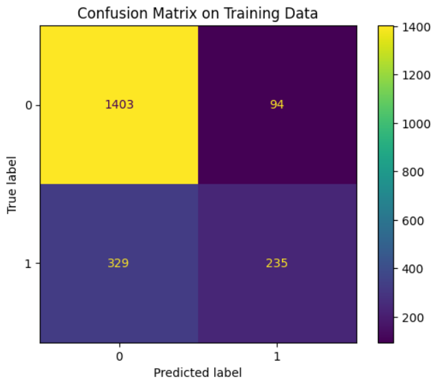

# Car Insurance Claims Prediction

## Overview

This project focuses on predicting the likelihood of a car insurance claim being filed. Using a dataset of 10,302 car insurance policies, the primary goal was to build a classification model to accurately identify policies that are likely to result in a claim. The dataset contains 27 features, including policyholder demographics (age, income, education), vehicle information (age, value), and driving history (MVR points, past claims).

The target variable, `IS_CLAIM`, is binary, with approximately **26.5%** of the policies in the training set resulting in a claim. The final model is an XGBoost Classifier, which was selected and tuned to achieve the best predictive performance.

## Key Insights from Exploratory Data Analysis

The initial data exploration revealed several factors that correlate with the probability of a claim:

- **Driving History:** The number of claims in the last 5 years (`5_year_num_of_claims`) and Motor Vehicle Record (MVR) points (`license_points`) showed the strongest positive correlations with filing a new claim. 
- **Socioeconomic Factors:** Lower income levels and lower home values are associated with a higher likelihood of a claim. 
- **Demographics:** Single parents (`single_parent`) tend to file more claims.
- **Vehicle Characteristics:** The age of the vehicle (`vehicle_age`) showed a negative correlation, suggesting that owners of newer cars are more likely to file claims.

## Major Steps

1.  **Data Cleaning:**
    - Renamed columns, removed unnecessary characters from features, and dropped irrelevant features to obtain a cleaned dataset.

2.  **Preprocessing & Feature Engineering:**
    - **Missing Values:** Handled 2,418 missing data points across 6 features using a `KNNImputer`, and categorical features were imputed using the most frequent value.
    - **Encoding:**
        - One-hot encoded 2 nominal categorical features (`occupation`, `vehicle_type`).
        - Ordinally encoded 1 feature (`highest_education`) based on its inherent rank.
        - Binary encoded 6 features (e.g., `single_parent`, `gender`).

3.  **Model Selection & Tuning:**
    - Evaluated 10 different classification models using 10-fold cross-validation and selected **XGBoost** for hyperparameter tuning due to its comparable performance and faster tuning time.
    - Conducted a `RandomizedSearchCV` with 2,000 iterations, followed by a more focused `GridSearchCV` to fine-tune the model's hyperparameters.

## Results

The tuned XGBoost Classifier demonstrated solid predictive performance on the unseen test data.

- **Cross-Validation Score (Training):** The final model achieved a weighted F1-score of **0.784** during 10-fold cross-validation.
- **Test Set Performance:** On the hold-out test set (20% of the data), the model achieved a weighted F1-score of **0.775**.

The confusion matrix on the test set provides a clear picture of the model's classification accuracy:

This project successfully developed a reliable model for predicting car insurance claims, with driving history and socioeconomic factors being the most significant predictors.
